# mcm-bluebox
Bluebox - part of the Micro Content Management system (MCM)

MCM consists of multiple components that form a small content management system.

### The other parts of the MCM project are
* [-- Deploy Environment (set up everything) --](https://github.com/timwaizenegger/mcm-deployEnvironment)
* [Bluebox web-UI](https://github.com/timwaizenegger/mcm-bluebox)
* [SDOS (Secure Delete Object Store) Cryptographic Deletion](https://github.com/timwaizenegger/mcm-sdos)
* [Metadata Extractor](https://github.com/timwaizenegger/mcm-metadataExtractor)
* [Retention Manager](https://github.com/timwaizenegger/mcm-retentionManager)

### This repo contains the web-UI

Bluebox is a web UI for the swift object store with Enterprise Content Management extensions. This is the UI for our larger "MCM" research project

Bluebox consists of two parts:
* a small server runtime written in python
* an angularJS frontend

they communicate over an HTTP API. 
The "frontend" is served by the python app as well but any static HTTP server could be used.  

## Screenshots

### Login screen

### Container list
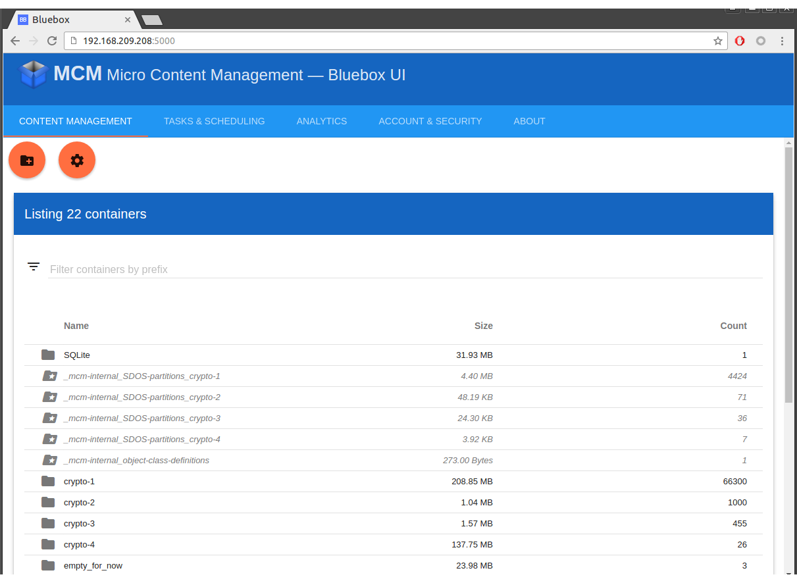

### Object class editing

### Create new container, enable SDOS encryption
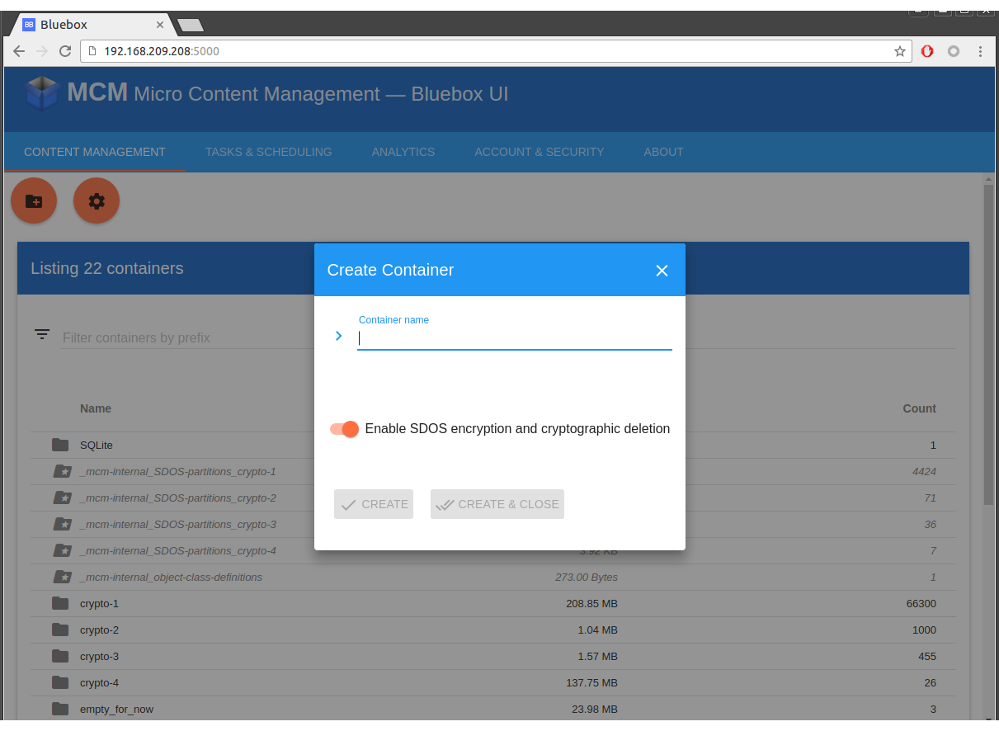

### Object list for SDOS enabled container
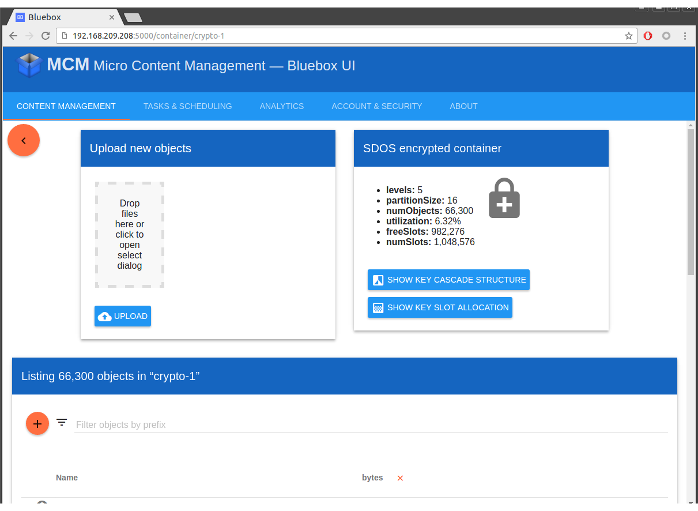

### Allocation view shows how object keys are distributed in the Key Cascade leaves
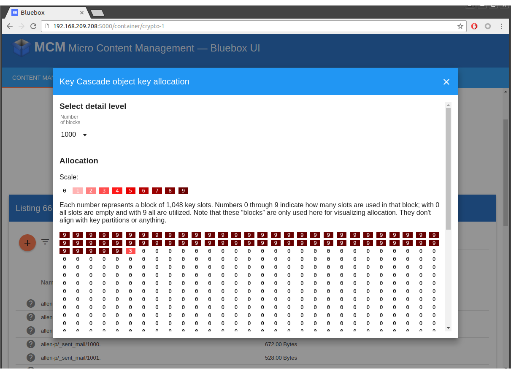

### Tree view shows the actual nodes of the Key Cascade; work in progress...
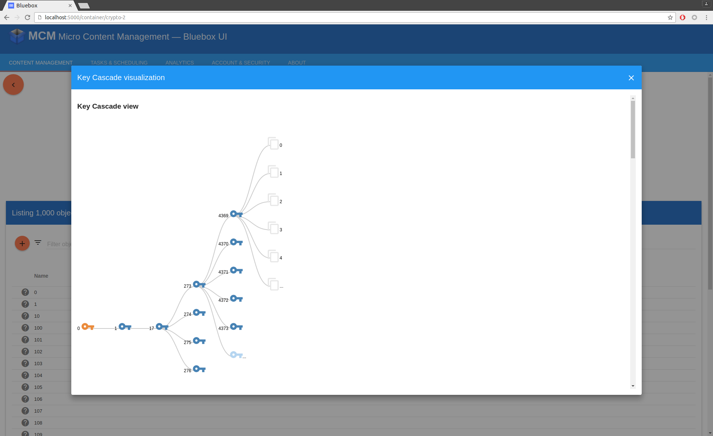

### Run tasks to extract/identify metadata and delete old objects
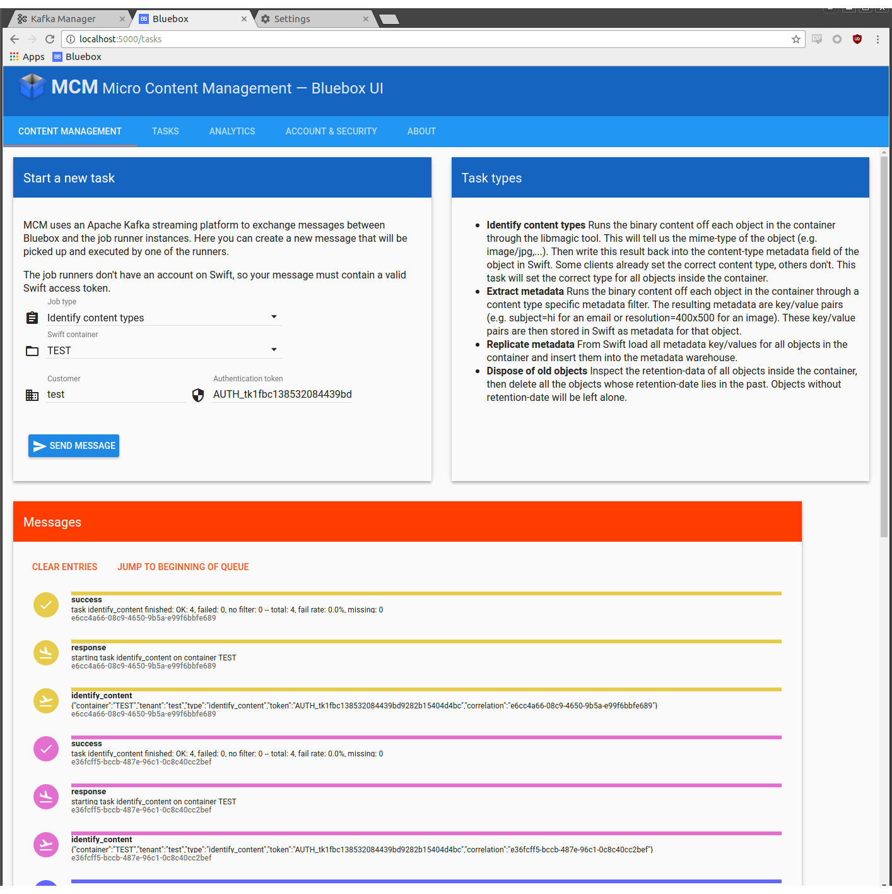

### Metadata is stored unencrypted and can be shown in list columns 
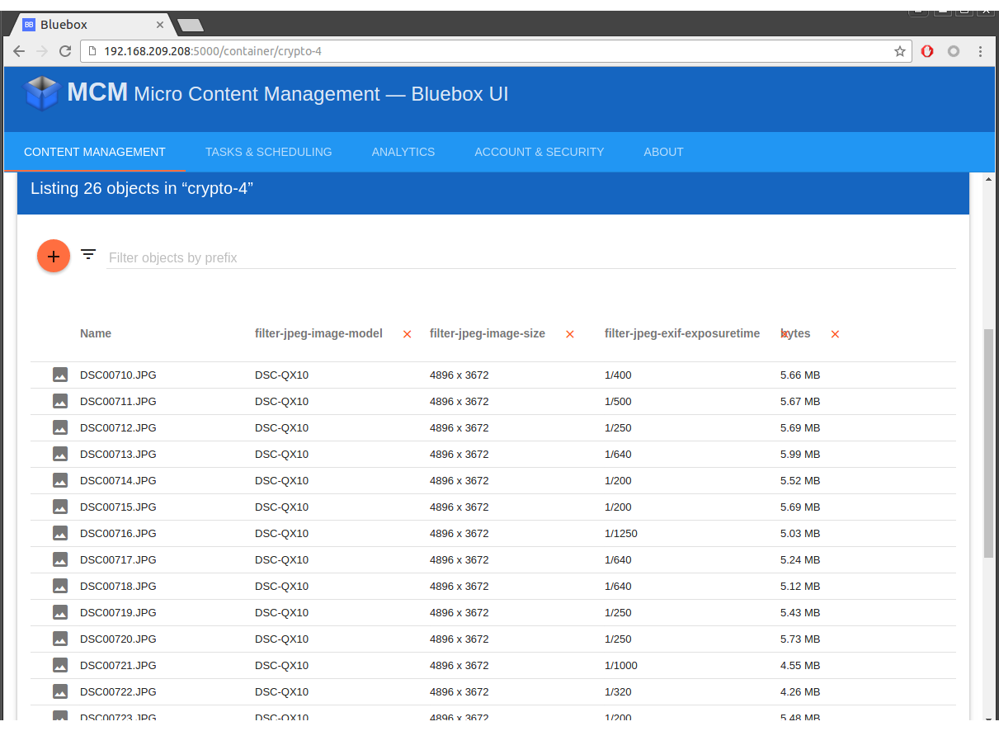

### All entity metadata (from swift) can be shown
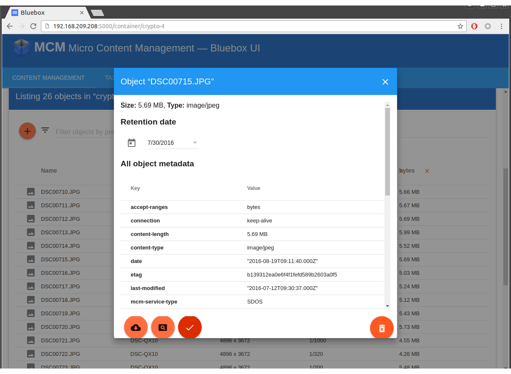

### Analytics module allows querying/visualizing metadata
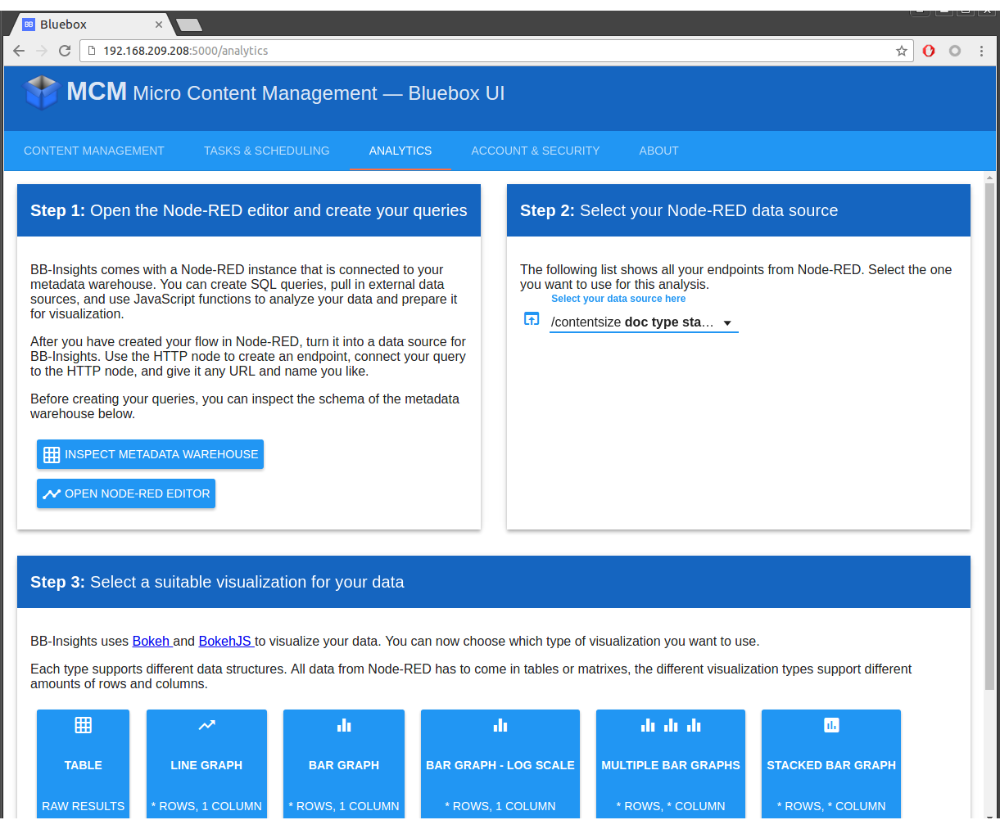

### Overview of all the metadata tables 
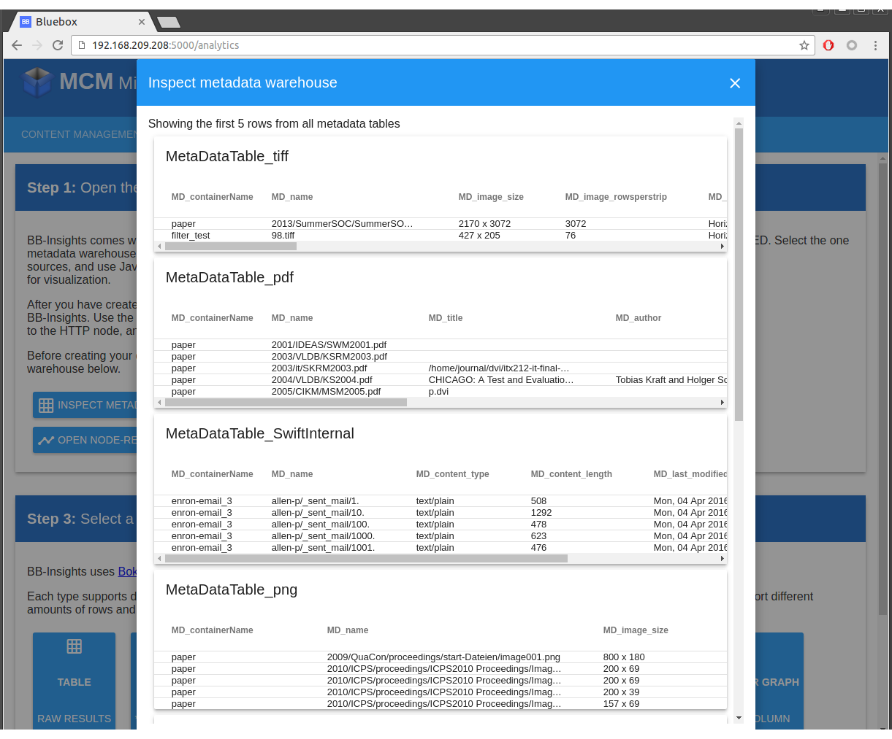

### Visualization result
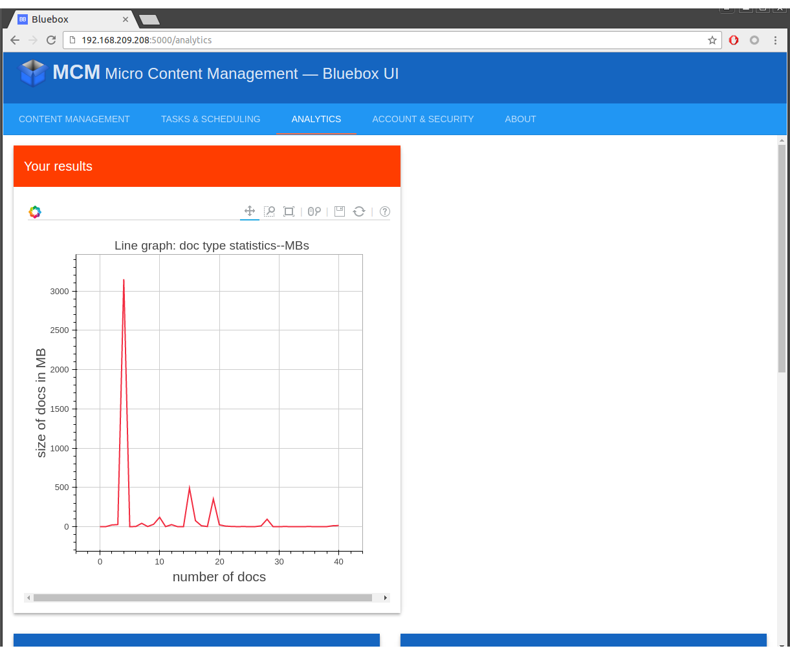

## Dev setup
### first setup after new checkout
make sure to specify a python 3 or higher interpreter for your virtualenv (MCM doesn't support python 2)
in the main directory

    virtualenv venvBB
    . setenv.sh
    (included in setenv) source venvBB/bin/activate
    pip install -r requirements.txt
    cd mcm/Bluebox/angular
    npm install
    
    
    

 
to leave venv

    deactivate
    
    
    
### install requirements
just install the existing reqs

    pip install -r requirements.txt
    cd mcm/Bluebox/angular
    npm install
    
install new packages

    pip install <package>
    cd mcm/Bluebox/angular
    npm install <package>

save new packages to requirements:

    pip freeze --local > requirements.txt
    cd mcm/Bluebox/angular
    npm install -S <package>
    
    
update existing packages

    pip freeze --local | grep -v '^\-e' | cut -d = -f 1 | xargs pip install -U
    pip freeze --local > requirements.txt

## Running
### running after first setup
in the main directory

    . setenv.sh

* for local development/testing: `python runApp_Development.py`
* for production: `./runApp_Production.sh`

### Running on IBM Bluemix (as "Bluemix app") / CloudFoundry
this is possible but hasn't been tested in some time.
* `Procfile` needs to be adapted to execute one of the runners
* dynamic connection to a swift service needs to be implemented; static config via the config file should work

## Configuration
configuration of the host/port is done inside the two "run" scripts mentioned above.

configuration of the swift backend connection is in the `appConfig.py` file. An example is given by `appConfig.example.py`

